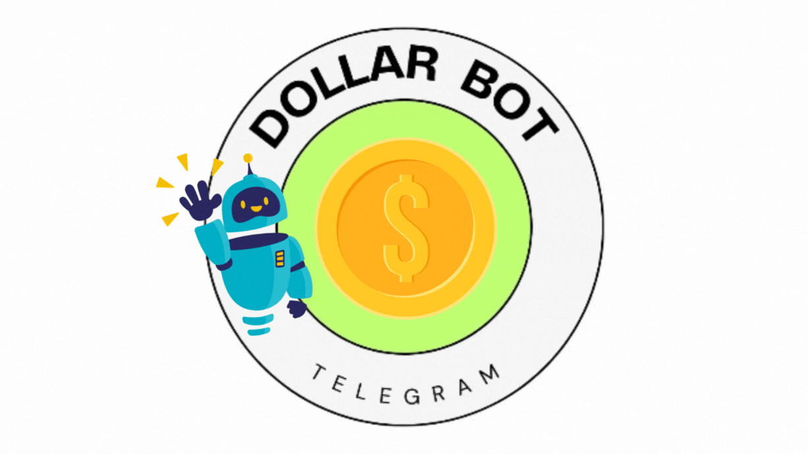
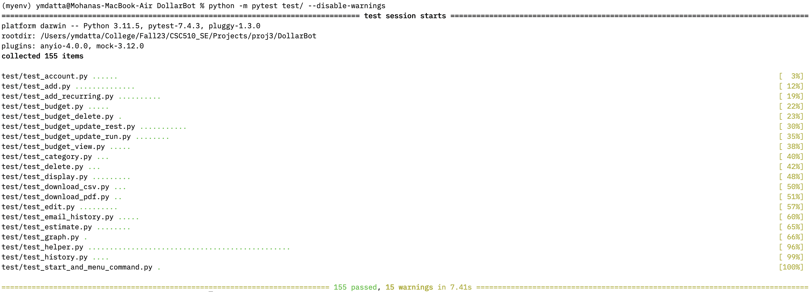

<hr>


[](https://desktop.telegram.org/)

[](https://github.com/rrajpuro/DollarBot/graphs/contributors)
[](https://doi.org/10.5281/zenodo.10210342)
[](https://app.travis-ci.com/github/sak007/MyDollarBot-BOTGo)
[](https://codecov.io/gh/sak007/MyDollarBot-BOTGo)
[](https://github.com/ymdatta/DollarBot/issues?q=is%3Aopen+is%3Aissue)
[](https://github.com/ymdatta/DollarBot/issues?q=is%3Aissue+is%3Aclosed)


<hr>

# 💰 DollarBot v2.0 - Budgeting	 On The Go 💰

<hr>
<p align="center">
<a></a>
</p>

# Description

DollarBot is an easy-to-use Telegram bot that assists you in recording and managing daily expenses on a local system without any hassle with simple commands.

[[Link to animated video]](https://www.canva.com/design/DAF1bJpmHtM/EGubjQOePxySaFfDb0sJMg/watch?utm_content=DAF1bJpmHtM&utm_campaign=designshare&utm_medium=link&utm_source=editor)

This bot has following functionalities:


## What DollarBot Can Do?

- Add/Record a new spending
- Calculate the sum of your expenditure for the current day/month
- Display your spending history
- Clear/Erase all your records
- Edit/Change any spending details if you wish to
- Recurring expense:
  Add a recurring expense that adds a certain amount every month to the user's spending, for any given category.
- Custom category:
  User can add a new category and delete an existing category as per the needs
- Budgeting:
  User can see the budget value for the total expense and/or for each of the existing categories in the /display function
- Better visualization:
  Added pie charts, bar graphs with and without budget lines for the user to have a look at the spending history in a better manner
  Added bar graph in the /history command to see spending across different categories
  User can see the daily and monthly expenses for spending history
- Delete particular expenses.
- Set a daily reminder to track your expenses for either the current day or the current month.
- Menu button to improve the UI.

## What's new in V2.0!!
- Maintain two types of accounts for spending purposes.
  - Checking Account
  - Savings Account
- Change type of account before making a purchase.
- Log spending expenses and balances in multiple currencies (USD, INR, GBP, EUR, CAD, and JPY).
- Ability to add new or update overall/category-wise budget in multiple currencies.
- Get alerts when your balance falls below a threshold value.
- Get errors if you are spending more money than what's available in your account.
- Download your expenses record in CSV, PDF format on the go.
- Send your expenses record to any email address in CSV format.
- User studies of the application.
- Detailed documentation for each code file.
- New and improved test cases for the code base.

## Use Case
* One can use DollarBot to save time one would otherwise spend manually inputting numbers into a spreadsheet -- all the while encouraging you to spend less and save more with budgeting feature. 

## Punch Line

* "If you can't measure it, you can't improve it." - Peter Drucker

  Use DollarBot to measure your expenses and spend wisely.

## Table of Contents

- [Demo](#demo)
- [Tech Stack](#techstack)
- [Development Tools](#development-tools) 
- [Installation](#installation)
  - [Pre-requisites](#pre-requisites)
  - [Actual installation](#actual-installation)
- [Testing](#testing)
- [Code Coverage](#code-coverage)
- [Usage](#usage)
- [Configuration](#configuration)
- [Road Map](#roadmap)
- [Contributing](#contributing)
- [License](#license)
- [Acknowledgements](#acknowledgements)
- [Support](#support)
- [FAQs](#faq)
- [Changelogs](#changelogs)
- [Code of Conduct](#code-of-conduct)

## Demo

[](https://www.youtube.com/watch?v=E7EAHumVHhk)

## Techstack


Starting from the external library dependencies to the testing of the application, everything is done in **Python 3**.

Python specific tools used:

- flake8
- codecov
- pytest

## Development tools 

   

## Installation

### Pre-requisite Tasks

Here are some pre-requisite tasks that you'll have to take complete before starting installation:

1. In Telegram App/Desktop, search for "BotFather". Click on "Start", and enter the following command:
```
  /newbot
```
2. Follow the instructions on screen:

    * Choose a name for your bot. 
    * Select a username for your bot that ends with "bot" (this is a rule Telegram enforces).

3. BotFather will confirm the creation of your bot and provide a HTTP API access token.
4. Copy and save this token for future use.

### Actual Installation

The below instructions can be followed in order to set-up communication with the bot from your end in a span of few minutes! Let's get started:

1. Clone this repository to your local system.
2. Start a terminal session in the directory where the project has been cloned. Run the following command to install the required dependencies:
```
  pip install -r requirements.txt
```
3. In the directory where this repo has been cloned, please run the below command to execute a bash script to run the Telegram Bot:
```
   ./run.sh
```
(OR)
```
   bash run.sh
```
4. It will ask you to paste the API token you received from Telegram in pre-requisites step 4.
5. A successful run will generate a message on your terminal that says "TeleBot: Started polling." 
6. In the Telegram app, search for your newly created bot by entering the username and open the same.
  
   Now, on Telegram, enter the "/start" or "/menu" command, and you are all set to track your expenses with DollarBot!

## Testing

  We use pytest to perform testing on all unit tests together. The command needs to be run from the home directory of the project. The command is:

  ```
  python run -m pytest test/
  ```
  (OR)
  ```
  python -m pytest test/
  ```

  Currently we have over **155** tests covering all functionalities of the bot. See the below output for more details.

  

## Code Coverage

Code coverage is part of the build. Every time new code is pushed to the repository, the build is run, and along with it, code coverage is computed. This can be viewed by selecting the build, and then choosing the codecov pop-up on hover.

Locally, we use the coverage package in python for code coverage. The commands to check code coverage in python are as follows:

```
coverage run -m pytest test/
coverage report
```

## Usage

We have tried to make this application (bot) as easy as possible. You can use this bot to manage and track you daily expenses and not worry about loosing track of your expenses. As we also have given in a functionality of graphing and plotting and history of expenses, it becomes easy for the user to track expenses.
To make your experience even better, we have added User Tutorials for all the basic operations you can perform with DollarBot!!
Here you go:
- [Learn to add Balance!!](https://github.com/r-kala/DollarBot/blob/main/docs/UserTutorialDocuments/AddBalanceTutorial.md)
- [Learn to add Expenses!!](https://github.com/ymdatta/DollarBot/blob/main/docs/UserTutorialDocuments/AddExpenseTutorial.md)
- [Learn to add Recurring Expenses!!](https://github.com/ymdatta/DollarBot/blob/main/docs/UserTutorialDocuments/AddRecurringExpenseTutorial.md)
- [Learn to display Expense Data with Graphs!!](https://github.com/ymdatta/DollarBot/blob/main/docs/UserTutorialDocuments/DisplayTutorial.md)
- [Learn to download Expense History Data as CSV!!](https://github.com/ymdatta/DollarBot/blob/main/docs/UserTutorialDocuments/DownloadCSV.md)
- [Learn to get detailed Expense Data via Email!!](https://github.com/ymdatta/DollarBot/blob/main/docs/UserTutorialDocuments/EmailSpendingTutorial.md)
- [Learn to estimate your future daily/monthly Expenses!!](https://github.com/ymdatta/DollarBot/blob/main/docs/UserTutorialDocuments/EstimateExpenseTutorial.md)
- [Learn to access your detailed Expense History!!](https://github.com/ymdatta/DollarBot/blob/main/docs/UserTutorialDocuments/ExpenseHistory.md)
- [Learn to set Expense Reminders!!](https://github.com/ymdatta/DollarBot/blob/main/docs/UserTutorialDocuments/SetReminderTutorial.md)

Link to feedback on DollarBot usage from users: [DollarBot Feedback Details](https://docs.google.com/document/d/1-2Ymohz238M43vACZSaMJzciNv_69CRBKFgrELbd-Bg/edit)

## Configuration

As a user, there's no need to configure any parameters
As a contributor, we have tried to make the system as decoupled as possible so that changes to one module/program doesn't affect other ones. With this being said, here are some configuration knobs that we have exposed for contributors:
1. Adding categories,
2. Removing categories,
3. Graphing changes,
4. Changing Telegram bot names etc.

## :interrobang: Troubleshooting


1) Ensure that you have a valid bot token. You can obtain a token by creating a new bot on Telegram through the BotFather.
2) Double-check that the token is correctly inserted into your bot's code or configuration.
3) Make sure your bot has the necessary permissions to perform the actions you've programmed it for.
4) If the issue still persists, please consider writing us at dollarbot38@googlegroups.com and we will get back to you as soon as possible.
5) You're also free to report a bug in our repository and clearly stating the issue that you're facing. Please make sure to follow the guidelines mentioned in [CONTRIBUTING.md](https://github.com/ymdatta/DollarBot/blob/main/CONTRIBUTING.md)

## Roadmap

### Phase 1:

- [x] Add/Record a new spending
- [x] Calculate the sum of your expenditure for the current day/month
- [x] Display your spending history
- [x] Clear/Erase all your records or individual expenses and edit/change any spending details if you wish to
- [x] Add a recurring expense that adds a certain amount every month to the user's spending, for any given category.
- [x] User can add a new category and delete an existing category as per the needs
- [x] User can see the budget value for the total expense and/or for each of the existing categories in the /display function
- [x] Added pie charts, bar graphs
- [x] Set a daily reminder to track your expenses for either the current day or the current month.
- [x] Menu button to improve the UI.

### Phase 2

- [x] Maintain two types of accounts for spending purposes - Checking Account and Savings Account
- [x] Change type of account before making a purchase.
- [x] Log spending expenses and balances in multiple currencies (USD, INR, GBP, EUR, CAD, and JPY).
- [x] Ability to add new or update overall/category-wise budget in multiple currencies.
- [x] Get alerts when your balance falls below a threshold value.
- [x] Get errors if you are spending more money than what's available in your account.
- [x] Download your expenses record in CSV, PDF format on the go.
- [x] Send your expenses record to any email address in CSV format.
- [x] User studies of the application.
- [x] Detailed documentation for each code file.
- [x] New and improved test cases for the code base.

### Future Enhancements

- [ ] Ability to add expenses of multiple users.
- [ ] Ability to manage expenses among multiple users to calculate aggregate sum owed.
- [ ] Adding a more robust cloud database.
- [ ] Aggregation of an AI/ML based estimator that takes into account inflation.
- [ ] Improve User Interface design.
- [ ] Adding normal conversational abilities to the chatbot.
- [ ] Ability to store pictures of physical bills tied to expenses for user reference.

 ### Link to Project Board: [DollarBot Project Board](https://github.com/users/ymdatta/projects/3)

## Contributing

Thank you for your interest in contributing to DollarBot! Your contributions are highly valued, and this document will help you get started with the process.
We have a fully detailed comprehensive document to look out for if you're looking into contributing towards this project!
Please refer this [CONTRIBUTING.md](CONTRIBUTING.md) file.

## LICENSE

By contributing to DollarBot, you agree that your contributions will be licensed under the project's open-source license. It's important to understand and respect the licensing terms before contributing. The specific license terms for this project can be found in the [LICENSE](LICENSE) file.

## :handshake: Contributors

(in alphabetical order)

1. Mohan Yelugoti (myelugo@ncsu.edu)
2. Rishabh Kala (rkala@ncsu.edu)
3. Sreehith Yachamaneni (syacham@ncsu.edu)

## Support

Please feel free to reach us at <dollarbot38@googlegroups.com> if you face any issues or for giving feedback in general. 
If you have used our Dollar Bot, feel free to give your feedback https://forms.gle/W354pePL3xw74jj76

## FAQs

1. Will we need a Telegram account to run this?

    A. Yes
2. Will we have to run multiple instances of the server for multiple clients?

    A. No
3. How can we reach out to the developers/contributors?

    A. Check the support section for details on reaching the developers.
4. What if I encounter a bug/have a feature request?

    A. Please raise an issue with the appropriate label to start a discussion and move forward.

## Changelogs

Please refer the following link for [CHANGELOG.md](CHANGELOG.md).

## Code of Conduct

Please note that we have a [Code of Conduct](CODE_OF_CONDUCT.md) that all contributors are expected to follow. It ensures that our community is welcoming and inclusive.

***Enjoy using DollarBot. Make sure to follow the page for any new updates!***
